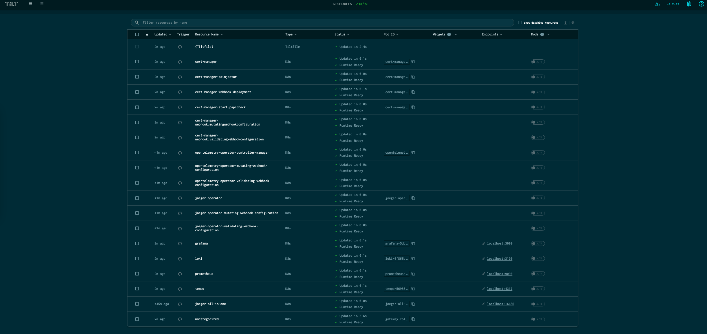
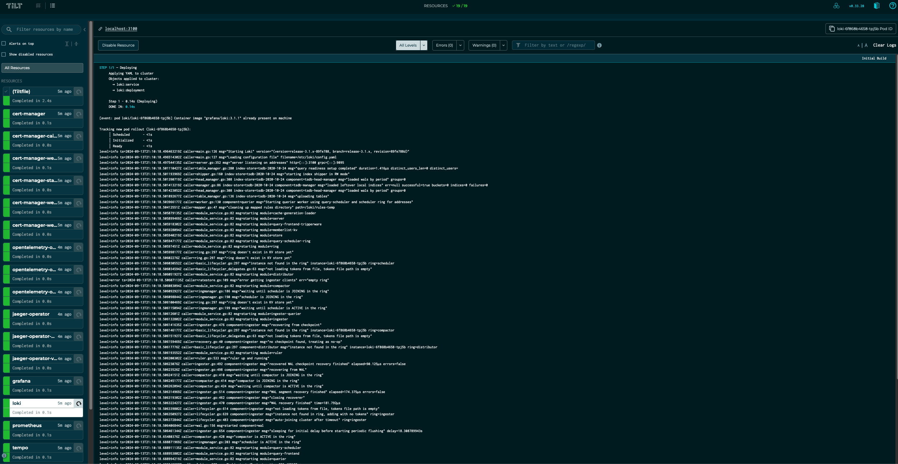
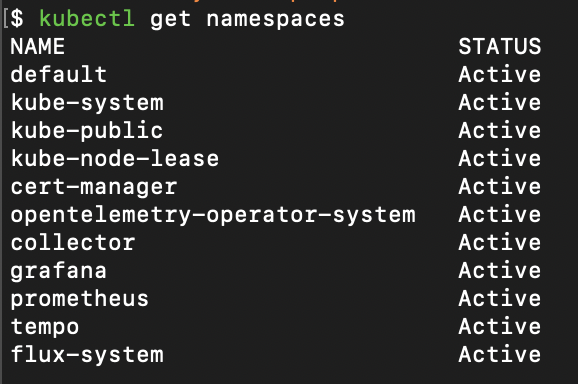
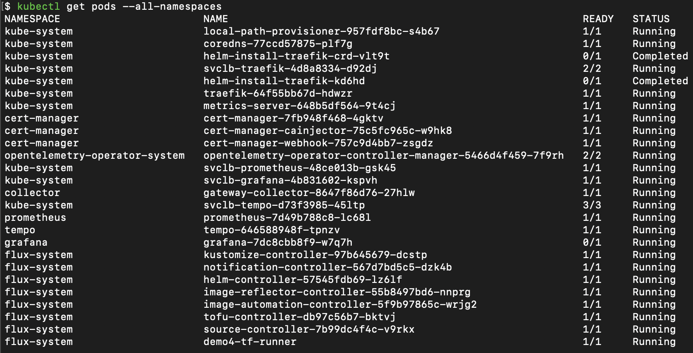
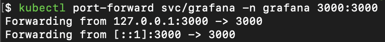
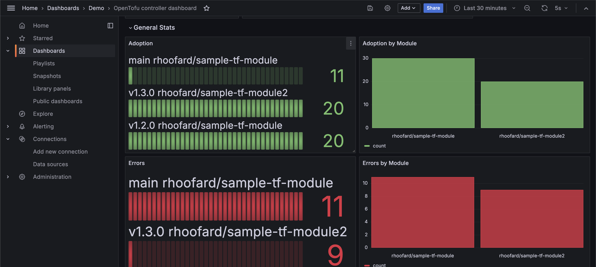
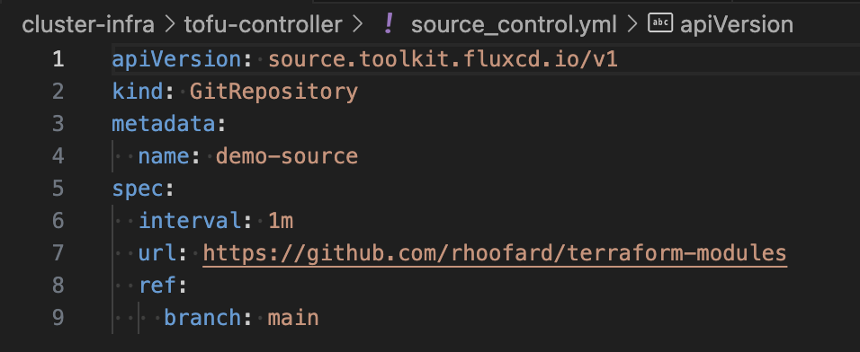
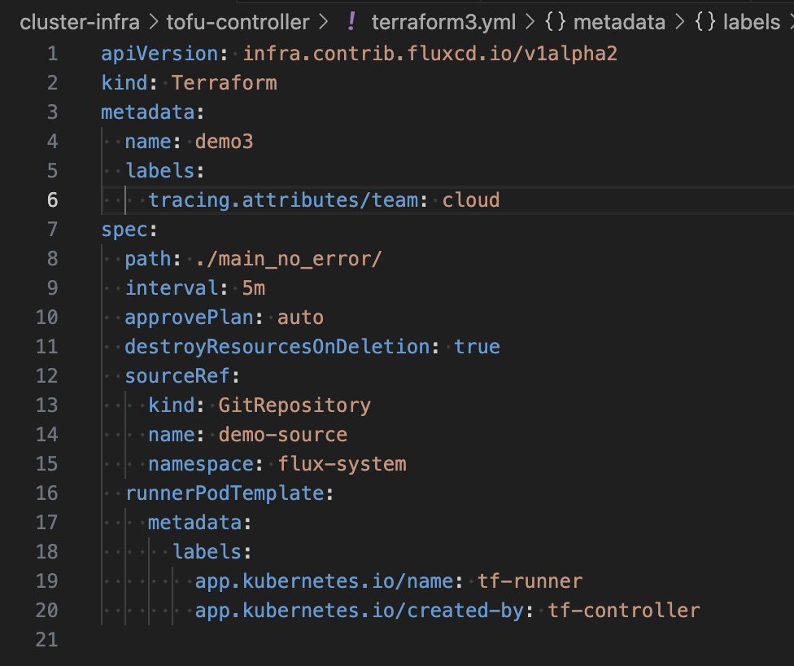

# tag-o11y-quick-start-manifests

> [!IMPORTANT]
> Visiting here from DevOps Days Montreal? Your demo is [here](#tracing-demo)

This set of manifests gets a local observability stack up and running quickly.
It installs the following services into your local kubernetes cluster:

- [Aspire Dashboard](https://aspiredashboard.com/)
- [OpenTelemetry Operator](https://opentelemetry.io/docs/kubernetes/operator/)
- [Cert Manager](https://cert-manager.io/)
- [Liatrio OpenTelemetry Collector](https://github.com/liatrio/otel-collector)

Simply run `brew bundle` and `make` to get started.

It can optionally install the following services: (requires reading through the command options)

- Grafana
- Prometheus
- Tempo
- Loki
- OpenTelemetry Controller
- NGrok Ingress and API Gateway Controller

## Prerequisites

> OSX users with [Homebrew][brew] installed can install the Prerequisites by running the command `brew bundle`

1. Run kubernetes locally. Here are a few options:
   1. [Docker Desktop][dd]: Local instance of Docker and k8s.
   2. [k3d][k3d]: a lightweight wrapper to run k3s (Rancher Lab’s minimal k8s distribution) in docker. (Required if using tilt)
2. Have kubectl installed
3. Have kustomize installed
4. Have [tilt][tilt] installed
5. If using DORA, have NGROK configured with a domain and update the configuration accordingly.
6. Have a free NGrok Account with a Permanent domain (if wanting to deploy DORA)
7. Have helm installed (gross, only for the ngrok helm chart, will remove this eventually)

## Quick Start

To deploy the basic set of configuration with Aspire Dashboard and a Gateway
Collector, run `make`. Then login to Tilt using by navigating to
[http://localhost:10350](http://localhost:10350) in your browser.

Port forwarding is automatically enabled when running Tilt. To view Telemetry
in Aspire Dashboard, navigate to [http://localhost:18888/](http://localhost:18888/).

## Gateway Collector

The gateway collector is created using an  OpenTelemetry Collector distribution
that Liatrio maintains called the Liatrio OTel Collector. The gateway collector
is configured to receive, process, and export the three observability signals;
metrics, logs and traces.

In the default quick start stack, the gateway collector:

* receives metrics and processes/exports them to Prometheus.
* receives logs and processes/exports them to Loki. 
* receives traces and processes/exports them to Tempo, Jaeger.

Why do you want to use the [Gateway][gw] collector? This collector is the entry point to forwarding telemetry to the analysis backends.

[gh]: https://opentelemetry.io/docs/collector/deployment/gateway/

<hr>

**Using Tilt (Optional)**
<br>
NOTE: Requires k3d<br><br>

Tilt takes care of creating resources and giving you access to the logs, as well
as creating any port-forwarding you need. You'll have easy access from tilt's
builtin dashboard.<br>

To spin up a k3d otel-basic cluster, and deploy the default LGTM stack with
tilt; run `make tilt-basic`. <br>

To spin up a k3d otel-eck cluster, and deploy the default ECK stack with tilt;
run `make tilt-eck`. <br>

When you're done, type `ctrl-c`. <br>

Below are a couple of examples of what the tilt dashboard provides you.





## Delivery Metrics

### Git Provider Receiver (GitHub) (Deprecated: Use GitHub Receiver)

To deploy the GitProvider Receiver:

1. Create a GitHub PAT
2. Create a `./collectors/gitproviderreceiver/.env` file containing `GH_PAT=<your GitHub PAT>`
3. Run `make gpr`

### GitHub Receiver

To deploy the GitHub Receiver

1. Create a GitHub PAT
2. Create a `./collectors/githubreceiver/.env` file containing `GH_PAT=<your GitHub PAT>`
3. Run `make ghr`

### Git Provider Receiver (GitLab)

<!-- TODO: Add instructions for GitLab -->

## DORA

The DORA Collector leverages the WebHook Events OpenTelemetry Receiver. As
events occur (like deployments) the event LogRecords are sent to the collector.
In order to enable sending of data from locations like GitHub, you have to be
able to route to your local installation of this collector. In this repository
we've defaulted to leveraging NGrok for this configuration. As such this
presumes that you have a free NGrok account, an API Key, and an AuthToken.

1. From the [NGrok dashboard][ngrok-dash] get your [API Key][ngrok-api] from NGrok.
2. Get your [Auth Token][ngrok-api] from NGrok.
3. Get your [free permanent domain][ngrok-domain] from NGrok.
4. Export your env vars:

   ```bash
   export NGROK_AUTHTOKEN=authtoken
   export NGROK_API_KEY=apikey
   ```

5. Run `make ngrok` to setup the controller.
6. Update the [webhook route config](./collectors/webhook/ngrok-route.yaml)
   with your permanent domain in the host rules (see example below):

   ```yaml
   spec:
   ingressClassName: ngrok
   rules:
     # Change this to match your NGrok permanent domain
     - host: example.ngrok-free.app
   ```

7. Run `make dora`

<!-- TODO: Add instructions for GitLab -->

## Tracing Demo


1. To run the demo, you will need to have a Kubernetes cluster running locally
   as well as `kubectl` installed. We will use [k3d](https://k3d.io/) to create
   a local cluster. If you do not have these installed, you can install them by
   running one of the followings commands depending on your OS:

   **Linux**

   ```bash
   curl -s https://raw.githubusercontent.com/k3d-io/k3d/main/install.sh | bash
   curl -LO "https://dl.k8s.io/release/$(curl -L -s https://dl.k8s.io/release/stable.txt)/bin/linux/amd64/kubectl"
   ```

   **Mac**

   ```bash
   brew install k3d
   brew install kubectl
   ```

2. Once we have these prerequisites installed, we can actually deploy the local
   cluster by running the following command:

   ```bash
   k3d cluster create mycluster
   ```

3. Once the cluster is created, we can actually deploy the demo resources
   themselves by running:

   ```bash
   make apply-traces
   ```

4. Verify that the namespaces are present and the pods are running. They should
   look like this:

   
   

5. Once everything is up and looking healthy, we can portforward the Grafana
   service to view the dashboard by doing the following:
   

6. Once the port-forward is setup, you can visit the Grafana dashboard by
   visiting `http://localhost:3000` in your browser. The dashboard will be the
   only one in the demo folder and will look like this:
   

   > [!IMPORTANT] Grafana will ask for a login which will just be the default
   > credentials of `username:admin password:admin`. It will ask you to change
   > it but you can skip this step if you would like.

### Cleanup

```bash
make delete-traces
```

## Tracing

We have an instrumented version of the flux-iac Tofu Controller which is part of
what makes this demo possible. Our fork with the changes are
[here][tofu-controller]

The other core piece of the demo is our instrumented version of the OpenTofu
binary. Similarly our fork with the changes are
[here][open-tofu]

## Configuration

To be able to use the Tofu Controller after deploying the `traces`
configuration with your own terraform, you will need to do the following.

1. Update the `source_control.yml` file in the `cluster-infra/tofu-controller/` folder so that
   it points towards a repository with terraform resources inside of it.
   

2. Update one of the `terraform.yml` files in the same folder so it references the name of the object you
   created with the `source_control.yml` file in the `sourceRef` field. Then
   update the `path` field with the specific path to the terraform resources
   you want to use inside the repository.
   

3. If you add your own files to the folder, you will need to update the
   `kustomization.yml` file in the folder to include the new files if you want
   them to be deployed with the rest of the resources

4. Run `make apply-traces` to update the resources in the cluster with the new
   configuration.

> - For the purposes of the tracing demo these will by default be configured
>   to apply null resources to the cluster since deploying resources to a
>   cloud provider requires an additional auth setup that is not done here.
> - Deploying kubernetes resources is also possible but requires you to update
>   the `tf-runner` service account with a cluster role that has permissions to
>   act on those resources.

[brew]: https://brew.sh/
[dd]: https://www.docker.com/products/docker-desktop/
[k3d]: https://k3d.io/v5.6.3/
[ngrok-api]: https://dashboard.ngrok.com/api
[ngrok-dash]: https://dashboard.ngrok.com/
[ngrok-domain]: https://dashboard.ngrok.com/cloud-edge/domains
[tofu-controller]: https://github.com/liatrio/tofu-controller/tree/tracing
[open-tofu]: https://github.com/liatrio/opentofu/tree/tracing
[tilt]: https://tilt.dev
